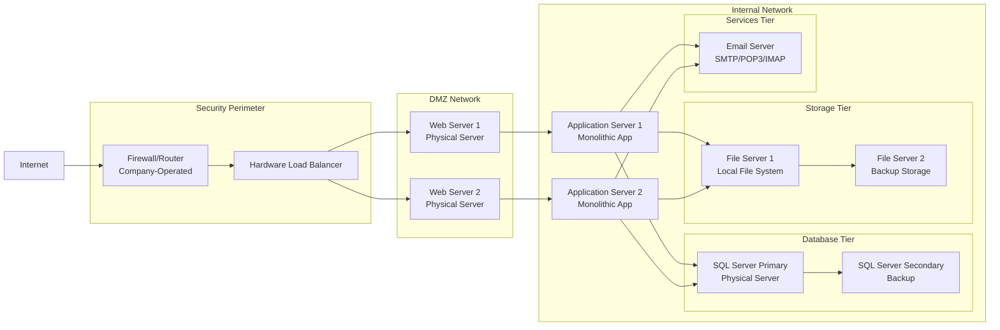

Section 1: On-Premises Solution Design

Since the company is a mid-sized retail one, and asuming no special cases are in play:  
key components:  
1. Network Infrastructure: Cloud-native networking:  
   Firewall/Router.  
   Load Balancer.   
2. Web Tier: IaaS (maintain control during transition):  
a-   Physical Web Servers.  
b-   Web Services.  
3. Application Tier: IaaS (maintain control during transition):  
a-   Monolithic Application.  
4. Data Tier: PaaS (reduced management overhead):  
a-   SQL Server Database.  
b-   Database Services.  
c-   Backup.  
5. Storage Tier: PaaS (improved scalability):  
a-    File Servers.  
6. Services Tier: SaaS (immediate cost savings):  
a-    Email Server.  

    

Section 2: Cloud Migration Strategy:  

1. Web Application Migration Strategy:  
Recommended Approach: IaaS (Initial) → PaaS (Long-term).  
The benefits of such strategy will be:  
Quick Win: Minimal code changes required.  
Risk Mitigation: Maintain current architecture during initial migration.  

2. Database Migration Strategy:  
Recommended Approach: Hybrid → PaaS.  
The benefits of such strategy will be:  
a- Compatibility: IaaS SQL VM ensures 100% feature compatibility.  
b- Gradual Optimization: Move to PaaS after validating performance.  
c- Fallback Option: IaaS provides easy rollback capability.  

3. File Storage Migration Strategy:  
Recommended Approach: PaaS (Direct).  
The benefits of such strategy will be:  
a- Immediate cost savings and scalability.  
b- API Compatibility: Easy integration with application updates.  

4. Email Services Migration Strategy:  
Recommended Approach: SaaS (Direct).  
The benefits of such strategy will be:  
a- Total Cost Ownership: Eliminates server maintenance costs.  
b- Feature Rich: Modern collaboration tools.  
c- Security: Enterprise-grade security and compliance.  

Detailed Migration Plan:   

Phase 1: Foundation & Assessment
Step 1: Discovery and Assessment:  
Application Discovery  
Cost Analysis  
Step 2: Proof of Concept:  
Migrate non-critical file share to Azure Blob Storage(for example)  
Validate network connectivity with cloud VPN   

Phase 2: Infrastructure Migration:  
Step 1: Networking Foundation  
Create cloud virtual network with subnets  

Establish site-to-site VPN connection  

Configure DNS resolution between on-prem and cloud  

Step 2: Email Migration 
Migrate email services to Google Workspace(for example)

Implement hybrid email configuration during transition

Step 3: File Storage Migration 
Implement Azure File Sync(for example)

Migrate file shares in batches  

Update application configurations to use cloud storage

Phase 3: Application Migration 
Step 1: Database Migration 
Implement database replication

Conduct performance testing

Step 2: Web Application Migration
Lift-and-shift to IaaS VMs

Minimal application changes

Quick migration benefits

Phase 4: Optimization & Decommission:
Step 2: Optimization
Implement cloud monitoring and alerting

Optimize resource utilization for cost savings

Establish cloud governance policies

Step 2: Decommission
Gradually decommission on-premises servers

Validate cloud operations stability

Complete knowledge transfer
