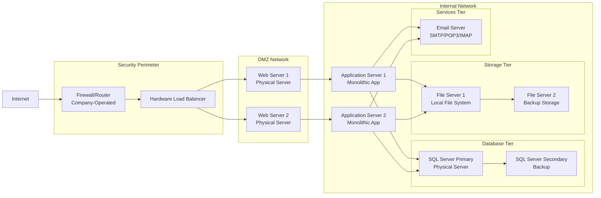

Section 1: On-Premises Solution Design

Since the company is a mid-sized retail one, and asuming no special cases are in play:
key components:
1. Network Infrastructure: Cloud-native networking:
   Firewall/Router.
   Load Balancer. 
2. Web Tier: IaaS (maintain control during transition):
a-   Physical Web Servers.
b-   Web Services.
3. Application Tier: IaaS (maintain control during transition):
a-   Monolithic Application.
4. Data Tier: PaaS (reduced management overhead):
a-   SQL Server Database.
b-   Database Services.
c-   Backup.
5. Storage Tier: PaaS (improved scalability):
a-    File Servers.
6. Services Tier: SaaS (immediate cost savings):
a-    Email Server.

    

Section 2: Cloud Migration Strategy:

1. Web Application Migration Strategy:
Recommended Approach: IaaS (Initial) → PaaS (Long-term).
The benefits of such strategy will be:
Quick Win: Minimal code changes required.
Risk Mitigation: Maintain current architecture during initial migration.

2. Database Migration Strategy:
Recommended Approach: Hybrid → PaaS.
The benefits of such strategy will be:
a- Compatibility: IaaS SQL VM ensures 100% feature compatibility.
b- Gradual Optimization: Move to PaaS after validating performance.
Fallback Option: IaaS provides easy rollback capability.

3. File Storage Migration Strategy:
Recommended Approach: PaaS (Direct).
The benefits of such strategy will be:
Immediate cost savings and scalability.
API Compatibility: Easy integration with application updates.

4. Email Services Migration Strategy:
Recommended Approach: SaaS (Direct).
The benefits of such strategy will be:
Total Cost Ownership: Eliminates server maintenance costs.
Feature Rich: Modern collaboration tools.
Security: Enterprise-grade security and compliance.

