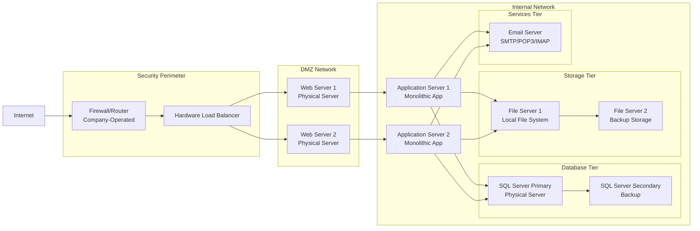

Section 1: On-Premises Solution Design

key components:
1. Network Infrastructure
   Firewall/Router
   Load Balancer: 
2. Web Tier
   Physical Web Servers
   Web Services
3. Application Tier
   Monolithic Application
4. Data Tier
   SQL Server Database
   Database Services
   Backup
5. Storage Tier
    File Servers
6. Services Tier
    Email Server

    Since the company is a mid-sized retail one, and asuming no special cases are in play:

Web Servers

Migration Strategies:
1. Web Application Migration Strategy
Recommended Approach: IaaS (Initial) → PaaS (Long-term)

Quick Win: Minimal code changes required
Risk Mitigation: Maintain current architecture during initial migration
Familiar Operations: IT team can use existing server management skills

2. Database Migration Strategy
Recommended Approach: Hybrid → PaaS

Compatibility: IaaS SQL VM ensures 100% feature compatibility
Gradual Optimization: Move to PaaS after validating performance
Fallback Option: IaaS provides easy rollback capability

3. File Storage Migration Strategy
Recommended Approach: PaaS (Direct)

Direct Benefits: Immediate cost savings and scalability
API Compatibility: Easy integration with application updates
Disaster Recovery: Built-in geo-redundancy

4. Email Services Migration Strategy
Recommended Approach: SaaS (Direct)

Total Cost Ownership: Eliminates server maintenance costs
Feature Rich: Modern collaboration tools
Security: Enterprise-grade security and compliance

