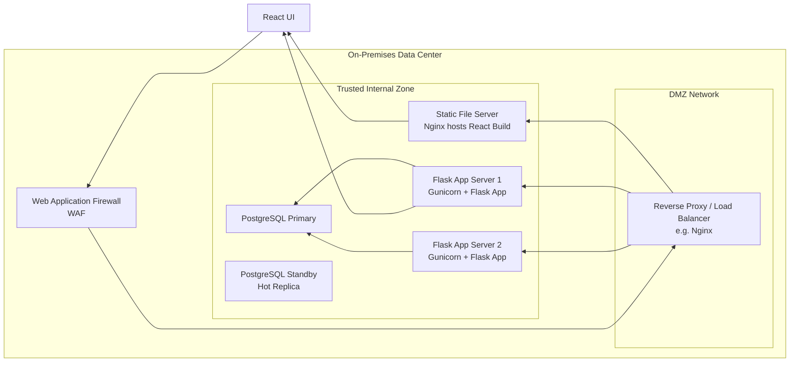
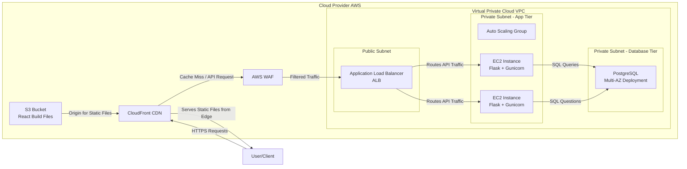
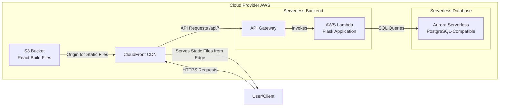

React UI: runs in the user browser

Web application firewall: a security layer that protects the application from attacks aimed at the web applications.

Reverse Proxy / Load Balancer: Acts as the main entry point for all incoming web traffic.

Static File Server: Hosts and serves the compiled React application.

Flask Application Server: Hosts the backend application logic and API.

PostgreSQL Database: one primary and one that serves as a reblica

Iaas:

Virtual Private Cloud 		A logically isolated section of the cloud where you launch resources. It provides control over your virtual networking environment, including IP ranges, subnets, and routing.

Public/Private Subnets		Subdivisions of the VPC. Public subnets host resources that need direct internet access (e.g., Load Balancer). 
                                Private subnets host resources that should not be exposed (e.g., App Servers, Databases), adding a critical security layer.

Compute Instances 	The virtual servers that host your application components (Flask with Gunicorn). You are responsible for OS patching, runtime installation, and application deployment.

Auto Scaling Group 		Automatically adds or removes VM instances based on load (e.g., CPU utilization). Ensures application availability and handles traffic spikes.

Load Balancer		Distributes incoming application traffic across multiple targets (EC2 instances) in the private subnet. 
                        Provides a single public endpoint and handles SSL termination.

Managed Database		While you could install Postgres on an EC2 instance, using a managed database is a best practice. The cloud provider handles backups, 
                                patching, replication, and failover. A "Multi-AZ" deployment provides high availability.

Content Delivery Network (CDN)		Caches the static React files from the Object Storage at edge locations worldwide, significantly improving load times for end-users.

Web Application Firewall (WAF)		Protects your application from common web exploits (SQL injection, XSS) by inspecting traffic before it reaches your load balancer and application.

Paas

Serverless Compute                 Instead of servers, you deploy your Flask application as a function. You pay only for execution time. The provider automatically scales it from zero
                                   to thousands of parallel executions without any administrative effort.

API Gateway		                     A fully managed service to create, publish, and secure APIs. It acts as the entry point for all API requests, routes them to Lambda,
                                  and handles authentication, rate limiting, and SSL.

Serverless Database		            The perfect database companion for serverless applications. Aurora Serverless automatically scales database capacity up and down based on load.
                                 You pay per second of use, and it can even pause when not in use.

Object Storage & CDN		           Used identically to the IaaS model to host the static React files efficiently. The CDN can also proxy API requests to the API Gateway.

