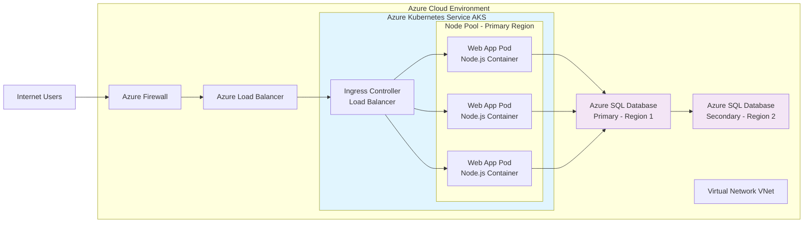

1.	Solution Diagram:

2.	A description of the target architecture:
The target architecture will include an Azure Firewall the links the internet with an Azure load balancer. To make use of Azure Kubernetes Service (AKS), The load balancer is connected to an Ingress Controller load balancer, that manages external HTTP-like traffic access to services within a cluster.  The Ingress load balancer is connected to multiple Web app pod Node.js containers, which will be connected to the primary Azure SQL Database. The primary Database will be connected to the secondary database as a backup.

3.	The steps of migration:
    
a.	Containerization of the web application:
   - Creating Dockerfile and .dockerignore
   - Building and testing container image locally
   - Pushing the image to Azure Container Registry 
   - Creating  Kubernetes deployment manifest
      
b.	Migration of the database to a managed SQL service.
      	 Pre-migration
   - Perform full database backup
   - Run Data Migration Assistant for compatibility check
   - Resize Azure SQL DB based on current usage
 
       Migration Execution
   - Start continuous data replication
   - Monitor replication lag and performance
   - Plan 6-hour downtime window for cutover
      
c.	Configuration of the Kubernetes cluster for high availability.
 
Best practice for Configuration of the Kubernetes:
-	Specifying the latest stable API version.
-	Storing Configuration files in version control before pushing them into the cluster. This allows you to quickly roll back a configuration change if necessary. It also aids cluster re-creation and restoration.

-	Writing configuration files using YAML rather than JSON. Though these formats can be used interchangeably in almost all scenarios, YAML tends to be more user-friendly.

-	Grouping related objects into a single file whenever it makes sense. One file is often easier to manage than several.

 
